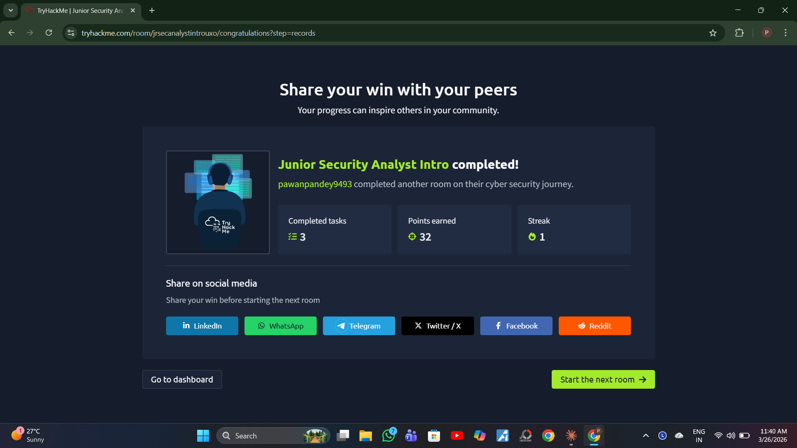

# Junior Security Analyst Intro

**Date:** 26-03-2026  
**Platform:** TryHackMe  
**Points Earned:** 32  
**Streak:** 1  

## What is a Junior Security Analyst?
First line of defense in a SOC team. Monitors alerts,
triages incidents, and escalates to senior analysts.

## SOC Tiers
- Tier 1 — Alert triage, monitor dashboards, escalate issues
- Tier 2 — Deep investigation, threat hunting
- Tier 3 — Advanced threats, pen testing, rule writing

## Key Responsibilities
- Monitor SIEM alerts 24/7
- Identify false positives vs real threats
- Document and escalate incidents
- Analyse network traffic and logs

## Tools Mentioned
- SIEM (Splunk, ELK)
- IDS/IPS
- Ticketing systems

## What I Learned
A Junior SOC Analyst is not just watching a screen —
they are the first responder to cyber threats. The role
requires knowing when to escalate and when to close an alert.

## Completion
