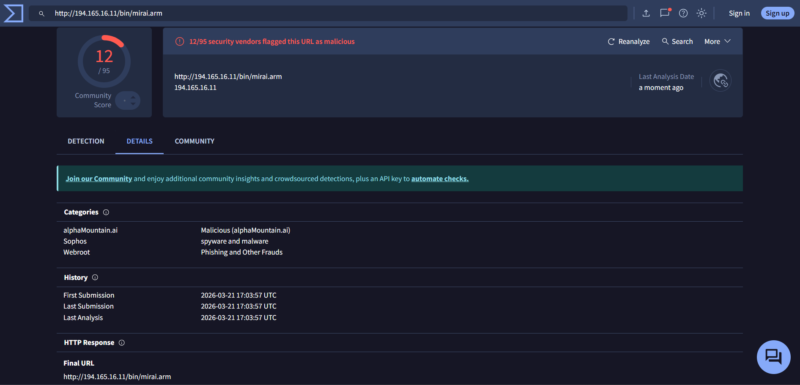
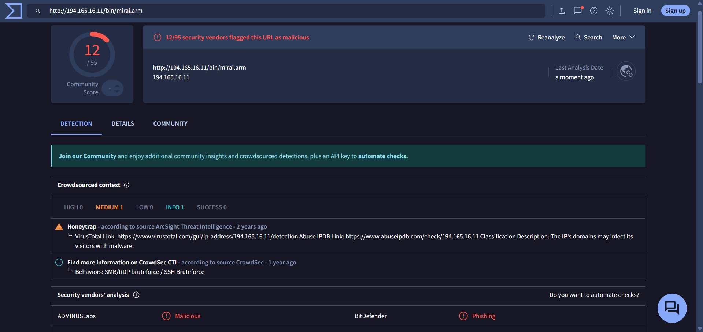
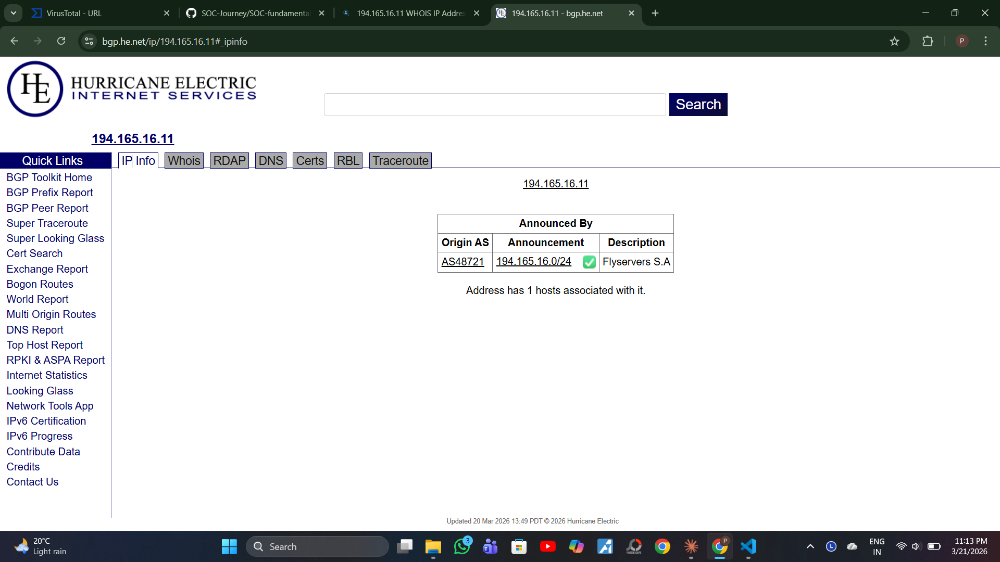
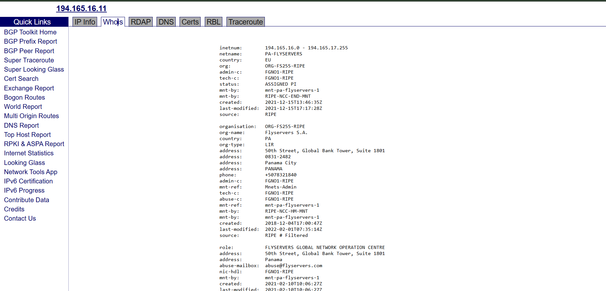
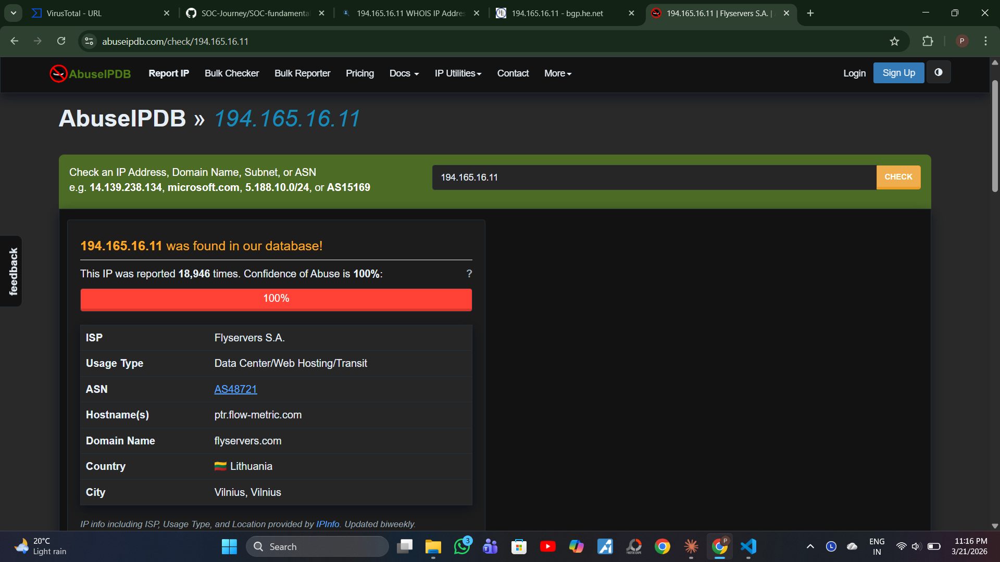
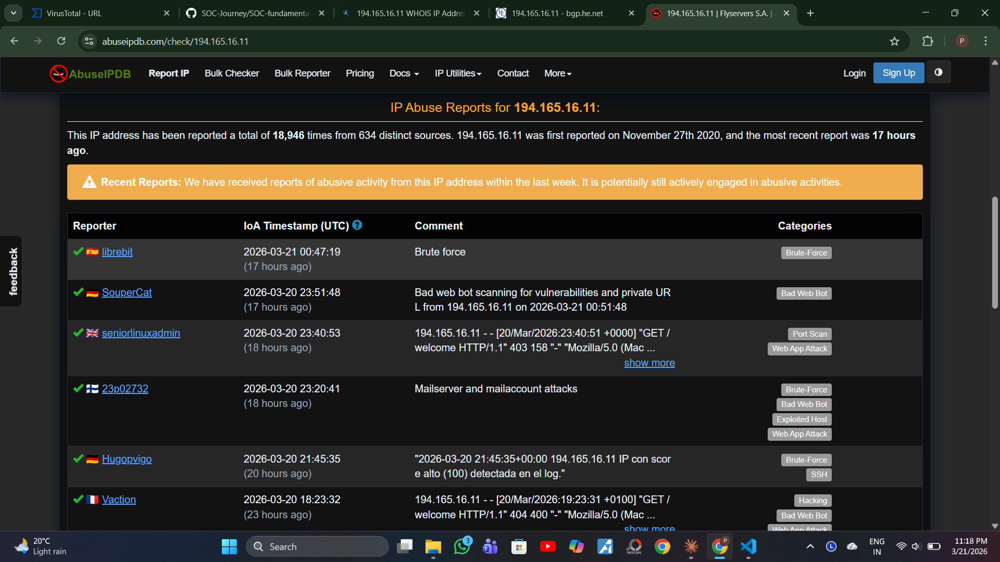
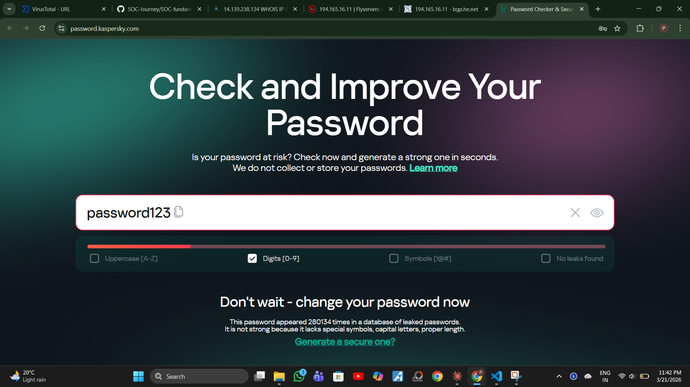
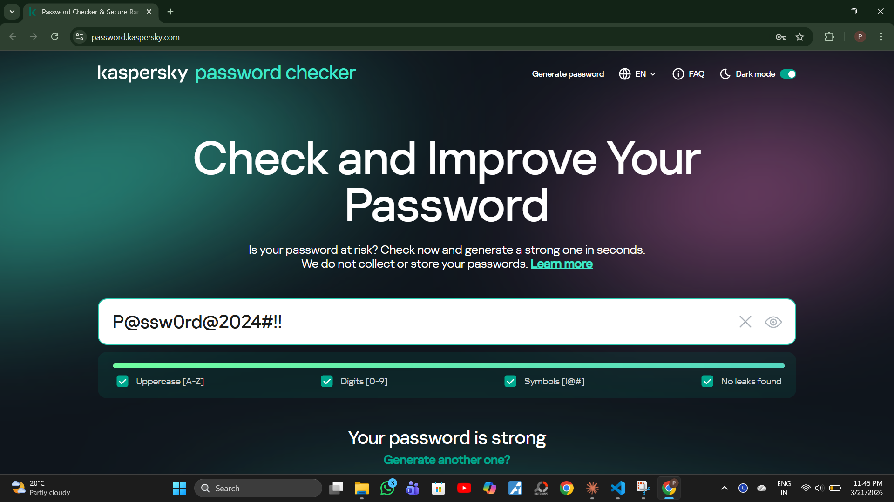

# Day 3 – Assignments

---

## Assignment 1 – Malicious URL Analysis (VirusTotal)
**Tool:** https://www.virustotal.com

### Steps Performed
1. Went to VirusTotal → URL tab
2. Pasted the suspicious URL and hit Enter
3. Reviewed the Detection tab — vendor analysis and crowdsourced context
4. Reviewed the Details tab — categories, history, and HTTP response info

### Findings

| Field | Result |
|-------|--------|
| URL Analyzed | http://194.165.16.11/bin/mirai.arm |
| Hosting IP | 194.165.16.11 |
| Detection Score | **12 / 95** security vendors flagged as malicious |
| Categories Flagged | Malicious (alphaMountain.ai), Spyware and Malware (Sophos), Phishing and Other Frauds (Webroot) |
| Vendors That Flagged | ADMINUSLabs — Malicious, BitDefender — Phishing, Sophos — Spyware and Malware, Webroot — Phishing and Other Frauds, alphaMountain.ai — Malicious |
| Crowdsourced Intel | **MEDIUM** alert — Honeytrap (ArcSight Threat Intelligence): IP domains may infect visitors with malware |
| Behavior (CrowdSec) | SMB/RDP Bruteforce, SSH Bruteforce |
| First Submission | 2026-03-21 17:03:57 UTC |
| Last Analysis | 2026-03-21 17:03:57 UTC |

### Screenshots

### Verdict
**MALICIOUS** — Confirmed malicious by 12 out of 95 security vendors.

The filename `mirai.arm` is associated with the **Mirai botnet** — malware that
targets IoT devices (routers, cameras) and enslaves them into a botnet for DDoS attacks.
The `.arm` extension indicates this is a compiled binary for ARM architecture devices.

The IP is also actively performing SSH and SMB/RDP bruteforce attacks,
meaning it is being used as attack infrastructure — not just hosting malware.

---

## Assignment 2 – WHOIS Lookup & Reputation Check
**Tools:** https://bgp.he.net + https://www.abuseipdb.com

### Steps Performed
1. Performed WHOIS/BGP lookup on IP using bgp.he.net
2. Noted ISP, ASN, network range, and owner info
3. Checked the IP on AbuseIPDB
4. Reviewed abuse confidence score, total reports, and attack categories

### WHOIS / BGP Findings

| Field | Result |
|-------|--------|
| IP Checked | 194.165.16.11 |
| IP Range | 194.165.16.0 – 194.165.17.255 |
| Network Name | PA-FLYSERVERS |
| ASN | AS48721 |
| Network Range | 194.165.16.0/24 |
| Owner / ISP | Flyservers S.A |
| Organisation | ORG-FS255-RIPE |
| Org Type | LIR (Local Internet Registry) |
| Address | 50th Street, Global Bank Tower, Suite 1801, Panama City, PANAMA |
| Abuse Email | abuse@flyservers.com |
| Usage Type | Data Center / Web Hosting / Transit |
| Hostname | ptr.flow-metric.com |
| Domain | flyservers.com |
| Country (AbuseIPDB) | Lithuania 🇱🇹 |
| City | Vilnius |
| Registry | RIPE NCC |
| Record Created | 2021-12-15 |
| Last Modified | 2021-12-15 |

### AbuseIPDB Findings

| Field | Result |
|-------|--------|
| IP Found in Database | ✅ Yes |
| Abuse Confidence Score | **100%** |
| Total Reports | 18,946 times from 634 distinct sources |
| First Reported | November 27th, 2020 |
| Last Reported | 17 hours ago (actively malicious) |
| Attack Categories | Brute-Force, SSH, Bad Web Bot, Port Scan, Web App Attack, Exploited Host, Hacking |

### Recent Attack Activity

| Reporter | Category | Description |
|----------|----------|-------------|
| librebit | Brute-Force | Brute force attack |
| SouperCat | Bad Web Bot | Scanning for vulnerabilities and private URLs |
| seniorlinuxadmin | Port Scan, Web App Attack | HTTP scanning activity |
| 23p02732 | Brute-Force, Exploited Host | Mailserver and mail account attacks |
| Hugopvigo | Brute-Force, SSH | High confidence SSH bruteforce |
| Vaction | Hacking, Bad Web Bot | Web App Attack |

### Screenshots

### Verdict
**HIGHLY MALICIOUS** — This IP has a 100% abuse confidence score with nearly 19,000
reports from 634 independent sources over 5 years, and was still actively attacking
systems just 17 hours ago.

It is hosted on Flyservers S.A — a data center in Lithuania commonly associated
with bulletproof hosting (hosting providers that ignore abuse complaints).
The IP is used for multiple attack types simultaneously: SSH bruteforce,
web app attacks, port scanning, and botnet activity (Mirai).

As an L1 SOC analyst, if this IP appeared in logs, it would be an immediate
escalation to L2 with a recommendation to block at the firewall.

---

## Assignment 3 – Password Strength Analysis
**Tool:** https://password.kaspersky.com

### Steps Performed
1. Tested a weak password (password123)
2. Tested a strong password (P@ssw0rd@2024#!!)
3. Compared strength bar, checklist, and verdict from the tool

### Results

| Field | Weak Password | Strong Password |
|-------|--------------|-----------------|
| Password Used | `password123` | `P@ssw0rd@2024#!!` |
| Strength Bar | 🔴 Red (Very Weak) | 🟢 Green (Strong) |
| Uppercase [A-Z] | ❌ Missing | ✅ Present |
| Digits [0-9] | ✅ Present | ✅ Present |
| Symbols [!@#] | ❌ Missing | ✅ Present |
| Leaked Password | ⚠️ Found 280,134 times in leaked databases | ✅ No leaks found |
| Verdict | "Don't wait — change your password now" | "Your password is strong" |
| Issues Found | No uppercase, no symbols, found in breach databases | None |

### Screenshots

### Key Takeaways – What Makes a Password Strong?
- **Length:** Minimum 12+ characters
- **Complexity:** Mix of uppercase, lowercase, numbers, and symbols
- **Unpredictability:** No dictionary words, names, or dates
- **Uniqueness:** Never reuse passwords across accounts
- **Breach Check:** Always verify your password hasn't appeared in leaked databases

> The password `password123` appeared **280,134 times** in real data breaches —
> meaning attackers already have it in their wordlists for brute force attacks.
> A strong password like `P@ssw0rd@2024#!!` passes all checks and has no known leaks.

---

> 💡 These assignments connect theory to real tools used daily by L1 SOC analysts.
> VirusTotal and AbuseIPDB are part of every alert investigation workflow.